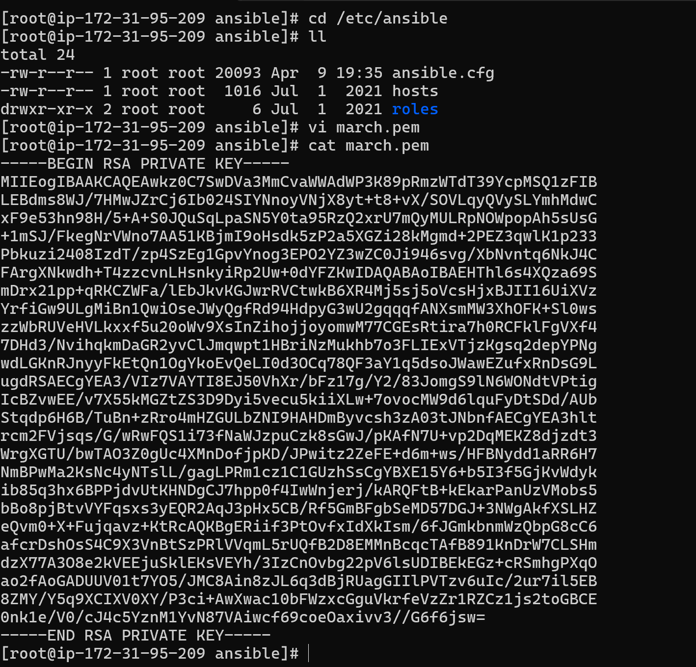

# 🚀 Static Website Deployment using Terraform, Ansible & Jenkins

This project demonstrates a complete CI/CD workflow to deploy a **static website**. The infrastructure is created using **Terraform**, configuration and deployment handled by **Ansible**, and the entire process is orchestrated via **Jenkins**. Terraform state files are securely stored in an **S3 bucket**.

---

## 🧱 Architecture Overview

- **Terraform**: Used to provision infrastructure (e.g., EC2 slave server).
- **S3**: Stores Terraform state files for safe and consistent state management.
- **Ansible**: Deploys a static website to the provisioned server.
- **Jenkins**: Automates the entire flow — from infrastructure provisioning to deployment.
- **Slack**: Sends pipeline status notifications.
- **Splunk**: Collects and monitors Jenkins logs.

---
## 📸 Architecture Diagram


---

## 📂 Project Structure

```bash
.
├── main.tf              # Terraform config for EC2
├── variables.tf         # Input variables for Terraform
├── backend.tf           # S3 backend configuration
├── ansible/
│   └── playbook.yml     # Ansible playbook to deploy static site
├── Jenkinsfile          # CI/CD pipeline definition
└── README.md
```

---

### 🧰 Step 1: Install AWS CLI & Configure Credentials

You can either:

- Manually configure AWS credentials using `aws configure`
- **OR**
- Attach an **IAM Role** with admin permissions to your EC2 instance

> ⚠️ **Security Note:**  
> Never store your AWS Access Keys, Secret Keys, or any sensitive credentials in your GitHub repository — especially in a **public repo**.  

#### 📥 Install AWS CLI on Amazon Linux:

```bash
vim ~/.bashrc
export PATH=$PATH:/usr/local/bin/
source ~/.bashrc

curl "https://awscli.amazonaws.com/awscli-exe-linux-x86_64.zip" -o "awscliv2.zip"
unzip awscliv2.zip
sudo ./aws/install
/usr/local/bin/aws --version
```

---

### 🧰 Step 2: Install Git, Jenkins on Your Server and Start Jenkins

Git is often installed automatically with Terraform, but you can manually install it if needed:

```bash
#STEP-1: INSTALLING GIT
yum install git -y

#STEP-2: GETTING THE REPO (jenkins.io --> download -- > redhat)
sudo wget -O /etc/yum.repos.d/jenkins.repo https://pkg.jenkins.io/redhat-stable/jenkins.repo
sudo rpm --import https://pkg.jenkins.io/redhat-stable/jenkins.io-2023.key

#STEP-3: DOWNLOAD JAVA17 AND JENKINS
yum install java-17-amazon-corretto -y
yum install jenkins -y

#STEP-4: RESTARTING JENKINS (when we download service it will on stopped state)
systemctl start jenkins.service
systemctl status jenkins.service
```
## 🔗 Accessing Jenkins Server
Once the infrastructure is provisioned and Jenkins is installed:

> 📍 **URL:** `http://<Instance_Public_IP>:8080`

---

## 🧰 Step 3: Install Terraform

Use the following commands to install Terraform on an Amazon Linux-based instance:

```bash
sudo yum-config-manager --add-repo https://rpm.releases.hashicorp.com/AmazonLinux/hashicorp.repo
sudo yum -y install terraform
```

---

### 🧰 Step 4: Install Ansible

Install Ansible on your Amazon Linux-based EC2 instance using the following commands:

```bash
sudo yum install python-pip -y
sudo amazon-linux-extras install ansible2 -y
```

## Step-5: Write pipeline code
```bash
pipeline {
    agent any
    stages {
        stage('Code') 
        {
            steps 
            {
                git branch: 'main', url: 'https://github.com/charan-kilana/Terraform-Ansible-Jenkins-pipeline.git'
            }
        }
        
        stage('Init')
        {
            steps
            {
                sh 'terraform init'
            }
        }
        stage('Plan')
        {
            steps{
                sh "terraform plan"
            }
        }
        stage('Apply'){
            steps{
                sh "terraform apply --auto-approve"
            }
        }
    }
}
```

#### 📸 Screenshot:


#Before Builiding code you gotta change few things in your terraform files

#### 📸 Screenshot:
- Go to s3.tf and give a unique bukcet name.
  
  
-For the first build remove the backend code
```bash
terraform {
backend "s3" {
region = "us-east-1"
bucket = "charan.devops.project.bucket"
key = "prod/terraform.tfstate"
}
}
```

- Go to main.tf and change image_id, key_name, subnets and availability_zones.
  <p align="center">
  
  
</p>

---


### 🧰 Step 5: Configure S3 Backend for Storing State Files

Once your pipeline is successful and the S3 bucket is created, you can configure Terraform to use **remote state storage** in an S3 bucket by adding the following to `s3.tf`:

```bash
terraform {
backend "s3" {
region = "us-east-1"
bucket = "charan.devops.project.bucket"
key = "prod/terraform.tfstate"
}
}
```

---

### 🧰 Step 6: Automate `terraform init` Confirmation for S3 Backend

When you configure the S3 backend in Terraform, running `terraform init` will prompt:

> `Do you want to migrate your state from local to remote (yes/no)?`

To automate this step in a pipeline (or shell script), you can echo `yes` into the command:

```bash
script
    {
    sh 'echo -e "yes\n" | terraform init'
    }
```

#### 📸 Screenshot:


#### 📸 Screenshot:


---


### 🧰 Step 7: Ansible Without Traditional Master-Slave Setup

Typically, before running an Ansible playbook, we:
- Set up a **master-slave architecture**
- Configure the **static inventory file** with IP addresses
- Handle **user creation**, **password authentication**, and **SSH key setup**

> ❗ But in this project, we’re **not following** the traditional Ansible master-slave setup.

---

### 🛠️ Requirement for Dynamic Inventory: Install `boto3`

If you're planning to use **Ansible dynamic inventory with AWS EC2**, you must install the **`boto3`** Python module on your Jenkins server (or wherever Ansible is run).

`boto3` is the **AWS SDK for Python** and is required by Ansible to fetch EC2 instance data dynamically.

#### 📦 Install `boto3` using pip:

```bash
sudo pip install boto3
```

### ⚙️ Configure Ansible for Dynamic Inventory with AWS EC2

Follow these steps to set up dynamic inventory using the AWS EC2 plugin:

#### 🔧 Step-by-Step:

1. **Go to the default Ansible config directory:**
   
- Go to default path **cd /etc/ansible/**
- Open ansible.cfg
- Define dynamic inventory
  inventory    =  /opt/ansible/inventory/aws_ec2.yml
- Add host_key_checking as false
  host_key_checking    =  False

- go to line number 330 and enable plugins **enable_plugins = aws_ec2**.  
  Our slave server info will be present in the aws_ec2.yaml
  
<p align="center">
  
  
</p>

2. Plugin Creation **/opt/ansible/inventory/aws_ec2.yml**

- Go to **cd /opt/**
- Create a folder ansible
  **mkdir ansible**
- Create a folder in ansible named inventory
  **cd ansible
  mkdir inventory**
- Write a plugin in **aws_ec2.yml**
  
```bash
---
plugin: aws_ec2
regions:
  - us-east-1
filters:
  tag:aws:autoscaling:groupName: web-server-asg        # Filtering slaves using tags
```

#### 📸 Screenshot:


- Go to cd /etc/ansible/ and copy the key-pair in that path.
  vim  **march.pem** and add the .pem file

  #### 📸 Screenshot:
  

---

---

### 🧰 Step 8: Add Ansible Stage in Jenkins Pipeline

To run the Ansible playbook as part of your Jenkins pipeline, add the following stage to your `Jenkinsfile`:

```bash
stage("AnsiblePipeline") {
    steps {
        sh 'ansible-playbook -i /opt/ansible/inventory/aws_ec2.yml /var/lib/jenkins/workspace/My_Deployment-1/ansible/deployment.yml'
    }
}
```

---

> 📝 **Note:**  
> Before building the pipeline, make sure to update a few values in the **`ansible/deployment.yaml`** file.

### 🔑 Update the Key Name

- Change the key name under the SSH connection section to match the key pair you're using for the EC2 instance.

#### 📸 Screenshot:


---


### 🧰 Step 9: Build the Pipeline

Once all configurations are in place (Terraform, Ansible, backend, inventory, etc.), you can now trigger the pipeline from Jenkins.


---

### 🎉 Hurray! Application Deployed Successfully

Your static website has been successfully deployed!

👉 Take the **public IP** of either of the EC2 instances (created by Terraform), paste it in your browser, and access the application.

#### 📸 Screenshot:


> ✅ You should see your deployed site running live on the EC2 instance!
  


